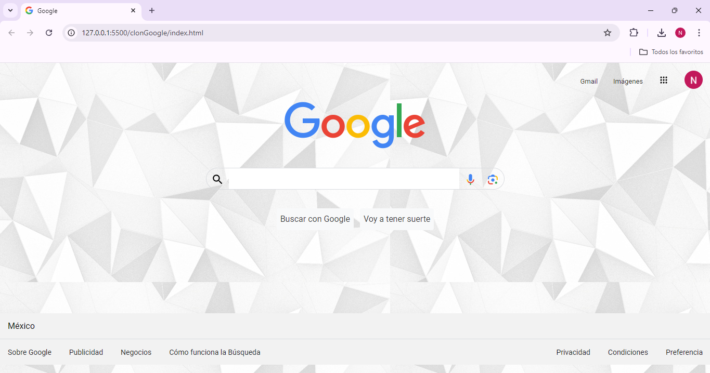

# Clon de Google TECHNOLOCHICAS PRO

Este proyecto es un clon de la página principal de Google. desarrollado para aplicar y consolidar las habilidades adquiridas durante el Bootcamp de Desarrollo Frontend de TECHNOLOCHICAS PRO.

Fue desarrollado con HTML y CSS.

La página es completamente responsiva, asegurando una visualización óptima en distintos tamaños de pantalla, e incluye un diseño fiel al estilo característico de Google.

[Proyecto Desplegado (https://clon-google-wine.vercel.app/)](https://clon-google-wine.vercel.app/)

## Secciones de mi sitio

## Tecnologías

* HTML
* CSS

---
Desarrollado por [Luna](https://www.instagram.com/luna_bess_/) en [TECHNOLOCHICAS PRO](https://tecnolochicas.mx/).